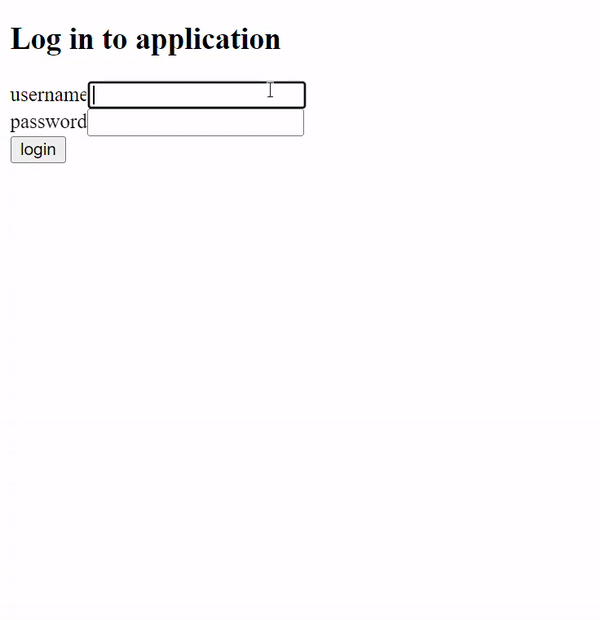

# Blog Style Application

A simple blog application that I built as a final project in a full-stack development course. 





## Before Running the Application

For this project, I used a MongoDB database (https://www.mongodb.com/). To get the backend up and running you'll have to set up your own database. This can be done by adding a "/backend/.env" file (not included in the repo). The .env file has to define at least these parameters: ```PORT=...```, ```MONGODB_URI=...```, ```TEST_MONGODB_URI=...```, and ```SECRET=...``` (login token). 
